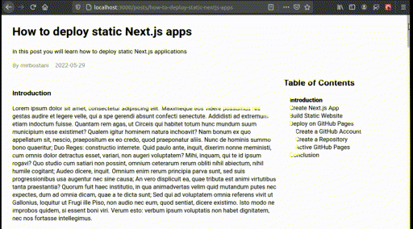
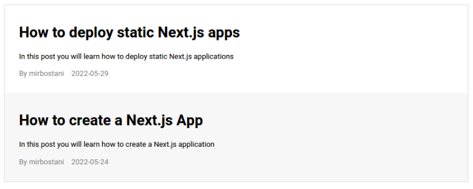
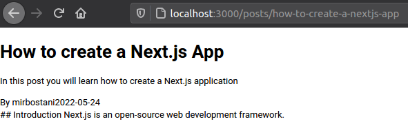
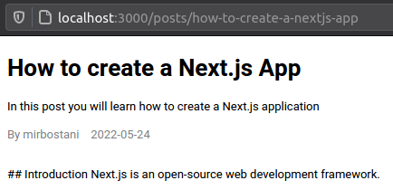
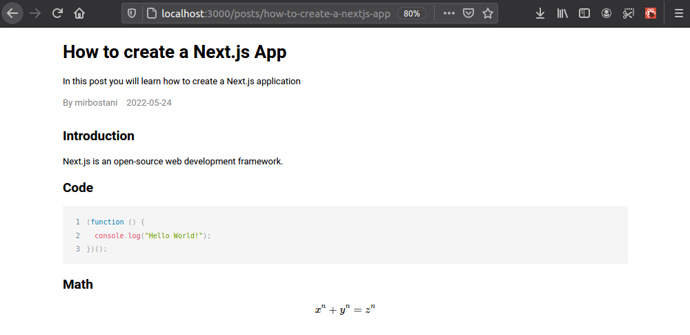
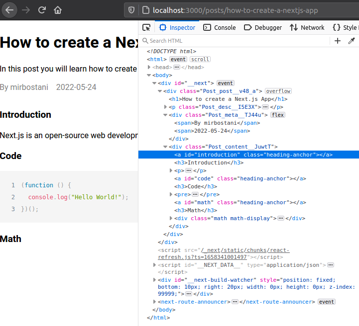
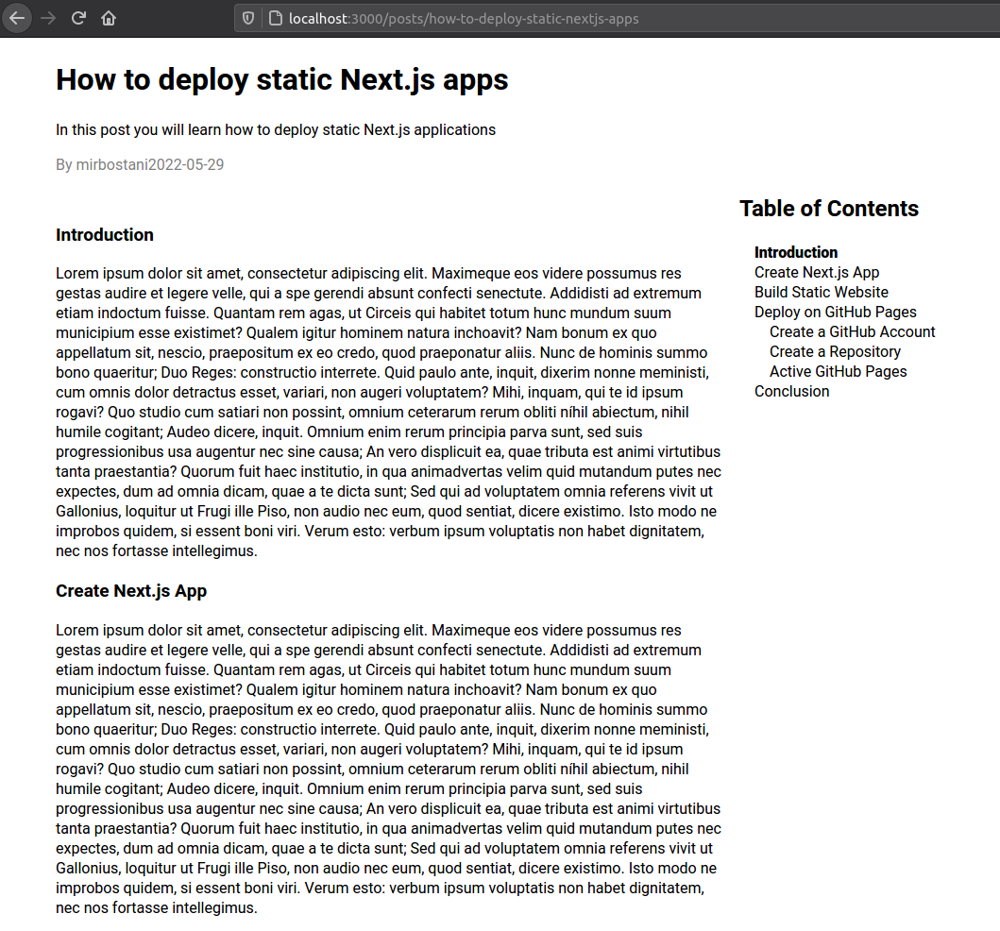

## Introduction

With all the available features offered in Next.js, you can easily create a full-fledged blog with markdown and Latex support. It enables you to write the articles in a markdown file and publish them statically. The blog pages will be generated based on the name of the markdown files, their YAML metadata, and content. Each markdown file is an article that will be rendered as an HTML page. However, to easily navigate through the page, we need a dynamic table of contents that enables us to jump to a specific heading and shows the current position in the article. In this article, we are going to build an auto-generated table of contents based on the headings of a markdown file. The output results will be as follows:



To view the full source code, you can visit [nextjs-markdown-blog-with-toc](https://github.com/mirbostani/nextjs-markdown-blog-with-toc) or clone the repository:

```shell
$ git clone https://github.com/mirbostani/nextjs-markdown-blog-with-toc
$ cd nextjs-markdown-blog-with-toc
$ npm install
$ npm run dev
```

## Create a Next.js App

The initial step is to create a Next.js project. First, make a new directory and navigate to it. Use the `create-next-app` tool to initialize a Next.js project and install dependencies.

```shell
$ mkdir nextjs-markdown-blog-with-toc && cd nextjs-markdown-blog-with-toc
$ npx create-next-app . --use-npm
```

If you haven't already had `create-next-app` on your system, install this CLI tool with `npm`.

```shell
$ npm i create-next-app
```

## Add "Posts" Page

First, we want to show a list of articles containing titles, descriptions, the author's name, and the publish date. Therefore, we need a top-level page to present this list. A suitable route would be `localhost:3000/posts`. To add it to the website, create the `pages/posts.js` file.

Every `.js` file inside the `pages` directory maps to a route on your website.

Inside the `pages/posts.js` file, write a function named `Posts` and export it as the default component. `Posts` receives `props.posts` as the input parameter that is an array of objects. Each object is associated with a single markdown file, i.e., a single blog post. Every post has a slug, which is the last part of the URL of the post, a title, description, author's name, and a publish date.

By iterating over the `posts` array with the `Array.prototype.map()` function, we can create a list of blog posts containing the blog title and description along with its metadata. Each blog post is wrapped around a `<Link>` component. It lets you navigate to different pages inside your website. Viewers of the website should be able to browse any blog post by simply clicking on it in the list. Therefore, `href` attribute of the `<Link>` is set to `/posts/<slug>`. Additionally, due to the uniqueness of the `slug` we can use it as the value of the `key` attribute for `map`'s returned components. This `key` is mandatory for React.js to be able to determine the changes in the components of an array.

```js
// pages/posts.js

import Link from "next/link";

export default function Posts({ posts }) {
  return (
    <div className="posts">
      {posts.length > 0 &&
        posts.map(({ slug, title, description, author, date }) => {
          return (
            <Link key={slug} href={`/posts/${slug}`}>
              <div className="card">
                <h1>{title}</h1>
                <p className="desc">{description}</p>
                <p className="meta">
                  <span>{`By ${author}`}</span>
                  <span>{date}</span>
                </p>
              </div>
            </Link>
          );
        })}
    </div>
  );
}
```

To populate `props.posts` of the `Posts` component with the data associated with the markdown files, we can make use of `getStaticProps()` method of the `posts.js` page. On website's static built, it returns the `props` object and passes it to the default component of the page, i.e., the `Posts` function. Inside, we call a function named `getPosts()` to retrieve posts' data.

```js
// pages/posts.js

import Link from "next/link";
import { getPosts } from "../libs/posts";

export async function getStaticProps() {
  const posts = getPosts({ page: 1, limit: 10 });
  return {
    props: {
      posts,
    },
  };
}

export default function Posts({ posts }) { ... }
```

## Parse Markdown Files

Functions related to the data retrieval are in the `lib/posts.js` file. We define the `getPosts()` function inside it. This function reads all the markdown files inside a specified directory (`./posts/*.md`), parses the files' content to extract the metadata in YAML format, and applies a pagination mechanism.

A simple example of a markdown file with front matter is as follows:

```md
---
title: "How to create a Next.js App"
description: "In this post you will learn how to create a Next.js application"
date: "2022-05-24"
author: "mirbostani"
---

## Introduction

Next.js is an open-source web development framework.

...
```

To parse YAML front matter, we use [gray-matter](https://www.npmjs.com/package/gray-matter) package.

```shell
$ npm install --save gray-matter
```

As the `*.md` files are placed inside the `posts` directory, we resolve the path using `path.resolve("posts")`. We read the file names synchronously with `fs.readdirSync()`.

The file name without the trailing `.md` string is the slug. We read the file content by `fs.readFileSync()` and parse the content with the `matter` function. We use the `matter(content).data` object to get the returned values. These properties are stored in the `posts` array. Each post object contains slug, content in markdown, metadata, and other properties.

Before returning the `posts` array, we call the `Array.prototype.sort()` method to sort the data based on the `date` metadata.

The last line implements pagination based on the `page` and `limit` parameters.

```js
// libs/posts.js

import fs from "node:fs";
import path from "node:path";
import * as matter from "gray-matter";

export function getPosts({ page, limit }) {
  page = page ?? 1;
  limit = limit ?? 10;

  // Read the markdown files (`posts/*.md`) 
  const dirPath = path.resolve("posts");
  const fileNames = fs.readdirSync(dirPath);

  // Prepare posts containing slug, content, and metadata
  let posts = fileNames.map((fileName) => {
    const slug = fileName.replace(/\.md$/i, "");
    const filePath = path.join(dirPath, fileName);
    const content = fs.readFileSync(filePath, { encoding: "utf-8" });
    const matterObject = matter(content);
    return {
      slug,
      ...matterObject.data,
    };
  });

  // Sort posts based on `date`
  posts
    .sort(({ date: a }, { date: b }) => {
      if (a > b) return 1;
      else if (a < b) return -1;
      else return 0;
    })
    .reverse();

  // Pagination
  return posts.slice((page - 1) * limit, page * limit);
}
```

## Start Dev Server

Run the `next dev -p 3000` command to start the development server. It is assigned to the NPM's `dev` script in `package.json` file.

```shell
$ npm run dev
```

Navigate to `localhost:3000/posts` in your favorite browser.

## Apply Styles

Add the following CSS rules to the `styles/global.css` file:

```css
/* styles/globals.css */

:root {
  --muted-color: gray;
  --hover-color: #f7f7f7;
}

.posts {
  margin: 2rem auto;
  max-width: 1024px;
  border: 1px solid var(--muted-color);
}

.card {
  padding: 1rem 2rem;
  cursor: pointer;
}

.card:hover {
  background-color: var(--hover-color);
}

.card .desc {
  margin-top: 0;
}

.card .meta {
  display: flex;
  flex-direction: row;
  gap: 16px;
  color: var(--muted-color);
  margin-top: 0;
}
```

The class names are added to the `Posts` component's children in `pages/posts.js` using the `className` attribute. The following output will be displayed on your browser.



## Add Blog Page

Create the `pages/posts/[slug].js` file. The `Post` component receives two parameters: `slug` and `post`. They are populated by the `getStaticProps()` method. When a URL like `localhost:3000/posts/<slug>` is opened in a browser, the value of `<slug>` part of the URL will be accessible in `getStaticProps()` using `props.params.slug` variable.

```js
// pages/posts/[slug].js

import { getPost, getPostsSlugs } from "../../libs/posts";

export async function getStaticPaths() {
  const paths = getPostsSlugs();
  return {
    paths,
    fallback: false,
  };
}

export async function getStaticProps({ params }) {
  const slug = params.slug;
  const post = await getPost(slug);
  return {
    props: {
      slug,
      post,
    },
  };
}

export default function Post({ slug, post }) {
  return (
    <div className="post">
      <h1>{post.title}</h1>
      <p className="desc">{post.description}</p>
      <div className="meta">
        <span>{`By ${post.author}`}</span>
        <span>{post.date}</span>
      </div>
      <div className="content">{post.contentMarkdown}</div>
    </div>
  );
}
```

Define `getPost()` and `getPostsSlugs()` methods in `libs/posts.js`. In `getPosts()`, `slug` is valid through the passed parameter. We use it to open the markdown file with the same base name, parse its content, and return it along with `slug` and other metadata.

Here, `getPostsSlugs()` is responsible for providing all the available slugs. They are used in Next.js to build the static website's internal links. We iterate over all the file names, extract, and return the slugs.

```js
import fs from "node:fs";
import path from "node:path";
import * as matter from "gray-matter";

export function getPosts({ page, limit }) { ... }

export async function getPost(slug) {
  const dirPath = path.resolve("posts");
  const filePath = path.join(dirPath, `${slug}.md`);
  const content = fs.readFileSync(filePath, { encoding: "utf-8" });
  const matterObject = matter(content);
  return {
    slug,
    contentMarkdown: matterObject.content,
    ...matterObject.data,
  };
}

export function getPostsSlugs() {
  const dirPath = path.resolve("posts");
  const fileNames = fs.readdirSync(dirPath);
  return fileNames.map((fileName) => {
    const slug = fileName.replace(/\.md/, "");
    return {
      params: {
        slug,
      },
    };
  });
}
```

## View Blog Post

To check if the functions are working properly, navigate to the `localhost:3000/posts/<slug>` link in which `<slug>` is the base name of a markdown file. For example, if your file is located in `posts/how-to-create-a-nextjs-app.md`, open the `localhost:3000/posts/how-to-create-a-nextjs-app` URL.

In files' path, `posts` refers to a local directory; however, in URLs, `posts` refers to the directory located in `pages/posts`.



Now apply some styles by modifying `styles/global.css` and adding the following classes.

```css
.post {
  width: 1024px;
  margin: 0 auto;
}

.desc {
  margin-top: 0;
}

.meta {
  display: flex;
  flex-direction: row;
  gap: 16px;
  color: var(--muted-color);
  margin-top: 0;
}

.content {
    margin: 2rem 0;
}
```

If your dev server is running, you will see the changes instantaneously.



## Render Markdown

As you can see, the markdown content is displayed as plain text. We need some tools to convert it to a proper HTML format. Install the following packages in your project:

```shell
$ npm install --save react-markdown remark-math rehype-katex react-syntax-highlighter
```

Create a `Markdown` component in the `components/markdown.js` file. This component is a wrapper for [`ReactMarkdown`](https://www.npmjs.com/package/react-markdown) component, which is responsible for converting markdown to HTML.

To support rendering mathematic formulas on the website, we use the [remark-math](https://www.npmjs.com/package/remark-math) and [rehype-katex](https://www.npmjs.com/package/rehype-katex) packages. 

`ReactMarkdown` has a `components` attribute. You can pass a function to access HTML tags and add features. To highlight the code, first, we access the `<code>` tag inside the `components()` function. We filter the ones with the `language-*` class, for example, `language-js`. Then, we wrap it with the `SyntaxHighlighter` component, passing Prism style, setting the language, enabling line numbers, passing the children, etc. However, when there is no match in the `language-*` CSS class search, we return a plain `<code>` tag accordingly. 

```js
// components/markdown.js

import ReactMarkdown from "react-markdown";

// Math support
import remarkMath from "remark-math";
import rehypeKatex from "rehype-katex";
import "katex/dist/katex.min.css";

// Syntax highlighting support
import { Prism as SyntaxHighlighter } from "react-syntax-highlighter";
import { prism as LightStyle } from "react-syntax-highlighter/dist/cjs/styles/prism";

function components() {
  return {
    code({ node, inline, className, children, ...props }) {
      const match = /language-(\w+)/.exec(className || "");
      return !inline && match ? (
        // Highlighted code
        <>
          <SyntaxHighlighter
            style={LightStyle}
            language={match[1]}
            PreTag="div"
            // eslint-disable-next-line react/no-children-prop
            children={String(children).replace(/\n$/, "")}
            showLineNumbers={true}
            customStyle={{
              backgroundColor: "rgba(245, 245, 245, 1)",
              opacity: "1",
            }}
            codeTagProps={{
              style: {
                backgroundColor: "transparent",
              },
            }}
            {...props}
          />
        </>
      ) : (
        // Plain code
        <code {...props}>
          {children}
        </code>
      );
    },
  };
}

// Wrapper for ReactMarkdown
export default function Markdown({ children }) {
  return (
    <ReactMarkdown
      remarkPlugins={[remarkMath]}
      rehypePlugins={[rehypeKatex]}
      components={components()}
    >
      {children}
    </ReactMarkdown>
  );
}
```

Now use `Markdown` by updating the `Post` component in `pages/posts/[slug].js`. Pass `post.contentMarkdown` to the `Markdown` component as a child.

```js
export default function Post({ slug, post }) {
  return (
    <div className="post">
      <h1>{post.title}</h1>
      <p className="desc">{post.description}</p>
      <div className="meta">
        <span>{`By ${post.author}`}</span>
        <span>{post.date}</span>
      </div>
      <article className="content">
        <Markdown>{post.contentMarkdown}</Markdown>
      </article>
    </div>
  );
}
```

Here is an example:



## Create ToC Widget

In this step, we want to create an auto-generated table of contents based on the headings available in the markdown file of the article. The following packages are required:

```shell
$ npm install --save remark remark-html jsdom
```

Modify the `libs/posts.js` file by adding the `getHeadingAnchors()` function to it. In `getPost()` method, we use `remark()` to parse the markdown content to HTML. Then, we pass it to the `getHeadingAnchors()` function, which is responsible for finding all the `<h1>`, `<h2>`, and `<h3>` tags, creating an ID based on the text content of the tag, and return the heading's type (`heading`), title (`title`), and prepared ID (`anchorId`). Finally, `getPost()` returns the heading anchors along with other properties.


```js
import fs from "node:fs";
import path from "node:path";
import * as matter from "gray-matter";

import { remark } from "remark";
import remarkHtml from "remark-html";
import jsdom from "jsdom";

export function getPosts({ page, limit }) { ... }

export async function getPost(slug) {
  const dirPath = path.resolve("posts");
  const filePath = path.join(dirPath, `${slug}.md`);
  const content = fs.readFileSync(filePath, { encoding: "utf-8" });
  const matterObject = matter(content);

  // Get heading anchors
  const processedContent = await remark()
    .use(remarkHtml)
    .process(matterObject.content);
  const contentHtml = processedContent.toString();
  const { headingAnchors, contentHtmlWithAnchors } =
    getHeadingAnchors(contentHtml);

  return {
    slug,
    headingAnchors, // return the anchors
    contentMarkdown: matterObject.content,
    ...matterObject.data,
  };
}

// Find and return anchors based on headings
function getHeadingAnchors(str) {
  const headingAnchors = [];
  const dom = new jsdom.JSDOM(`<div id="headinganchors">${str}</div>`);
  dom.window.document.querySelectorAll("h1, h2, h3").forEach((hx) => {
    const id = hx.textContent.toLowerCase().replace(/\s+|[^a-z0-9]/g, "_");
    const anchor = dom.window.document.createElement("a");
    anchor.id = id;
    hx.insertBefore(anchor, null);

    headingAnchors.push({
      heading: hx.nodeName.toLowerCase(),
      title: hx.textContent,
      anchorId: id,
    });
  });
  const contentHtmlWithAnchors =
    dom.window.document.getElementById("headinganchors").innerHTML;
  return {
    headingAnchors,
    contentHtmlWithAnchors,
  };
}
```

For example, applying `getHeadingAnchors()` on the following markdown content:

```markdown
# Heading 1

## Heading 2
```

will result in:

```js
[
   {
     heading: "h1",
     title: "Heading 1",
     anchorId: "heading-1"
   },
   {
     heading: "h2",
     title: "Heading 2",
     anchorId: "heading-2"
   },
]
```

Now, on the output HTML content, we need to add anchors before headings so that when we click on a link in the table of content, the browser will jump to the respective anchor in the article.

To do so, update the `components` function in `components/markdown.js` to add anchors before headings:

```js
function components() {
  const hx = (children) => {
    const id = children
      .join("")
      .toLowerCase()
      .replace(/\s+|[^a-z0-9]/gi, "_");
    return (
      <>
        <a id={id} className="heading-anchor"></a>
        <h3>{children}</h3>
      </>
    );
  };
  return {
    code({ node, inline, className, children, ...props }) {
      ...
    },
    h1({ node, inline, className, children, ...props }) {
      return hx(children);
    },
    h2({ node, inline, className, children, ...props }) {
      return hx(children);
    },
    h3({ node, inline, className, children, ...props }) {
      return hx(children);
    },
  };
}
```

If you inspect the output in your browser, you should see `<a>` tags with `id` and class set to `heading-anchors` before headings.



Modify `pages/posts/[slug].js` to add a sidebar to the blog page. The sidebar and content are the children of the wrapper `<div>`.

```js
// pages/posts/[slug].js

export default function Post({ slug, post }) {
  return (
    <div className="post">
      <h1>{post.title}</h1>
      <p className="desc">{post.description}</p>
      <div className="meta">
        <span>{`By ${post.author}`}</span>
        <span>{post.date}</span>
      </div>
      <div className="wrapper">
        <aside className="sidebar">
          <div className="toc">
            <h1>Table of Contents</h1>
            {post.headingAnchors.length > 0 && (
              <ul>
                {post.headingAnchors.map((anchor) => {
                  return (
                    <li
                      id={`toc-${anchor.anchorId}`}
                      key={anchor.anchorId}
                      className={`ml${anchor.heading[1]} toc-anchor`}
                    >
                      <a href={`#${anchor.anchorId}`}>{anchor.title}</a>
                    </li>
                  );
                })}
              </ul>
            )}
          </div>
        </aside>
        <article className="content">
          <Markdown>{post.contentMarkdown}</Markdown>
        </article>
      </div>
    </div>
  );
}
```

We apply some styles to align the sidebar to the right and make it sticky when we scroll down the page. If the window's width is less than 1024px, the sidebar will be placed on top of the article. However, for windows width bigger than 1024px, the sidebar will be on the right side of the page, sticking to the top while scrolling.

```css
/* styles/global.css */

.ml1 {
  margin-left: 1rem;
}

.ml2 {
  margin-left: 2rem;
}

.ml3 {
  margin-left: 3rem;
}

.post {
  width: 1024px;
  margin: 0 auto;
}

.post .desc {
  margin-top: 0;
}

.post .meta {
  display: flex;
  flex-direction: row;
  color: var(--muted-color);
  margin-top: 0;
}

.post .wrapper {
  display: flex;
  flex-direction: column;
}

.post .content {
  margin: 2rem 0;
}

.post .sidebar {
  display: flex;
  flex-direction: column;
  margin-left: var(--margin);
}

.post .toc ul {
  padding: 0;
}

.post .toc li {
  list-style-type: none;
  font-weight: normal;
}

.post .toc li.active {
  font-weight: 800 !important;
}

@media (min-width: 1024px) {
  .post .wrapper {
    flex-direction: row-reverse;
  }

  .post .sidebar {
    align-self: flex-start;
    width: 300px;
    position: -webkit-sticky;
    position: sticky;
    top: 1rem;
  }

  .post .content {
    width: calc(100% - var(--margin) - 300px);
  }
}
```

## Active ToC Items

To make the items in the table of contents re-act and become emphasized during the scroll event, first, we have to capture the `scroll` event. To achieve this effect, we create a state named `scrollTop` with `useState()` and set its initial value to `0`. Then we capture its changes using the `useEffect(() => {}, [scrollTop])` hook inside the `Post` component.

To capture the `scroll` event, we call `addEventListener` on the `window` object. Don't forget to call `removeEventListener` when `useEffect()` is finished.

We call `updateTocAnchors()` on each scroll update. This method searches for the heading anchors visible on the browser's window and highlights the corresponding item on the table of contents widget based on the heading anchor ID.

```js
// pages/posts/[slug].js

import { getPost, getPostsSlugs } from "../../libs/posts";
import Markdown from "../../components/markdown";

import { useState, useEffect } from "react"; // React hooks

export async function getStaticPaths() { ... }

export async function getStaticProps({ params }) { ... }

export default function Post({ slug, post }) {
  const [scrollTop, setScrollTop] = useState(0);

  useEffect(() => {
    const updateTocAnchors = (e) => {
      const headingAnchors = e.target.documentElement.querySelectorAll(
        ".post .article .heading-anchor"
      );
      if (headingAnchors.length === 0) return;
      const activeHeadingAnchors = Array.from(headingAnchors).filter(
        (anchor) => {
          const rect = anchor.getBoundingClientRect();
          return (
            rect.top >= 0 &&
            rect.left >= 0 &&
            rect.bottom <= e.target.documentElement.clientHeight &&
            rect.right <= e.target.documentElement.clientWidth
          );
        }
      );
      if (activeHeadingAnchors.length === 0) return;
      // Deactive all ToC anchors
      const tocAnchors = e.target.documentElement.querySelectorAll(
        ".post .sidebar .toc .toc-anchor"
      );
      if (tocAnchors.length === 0) return;
      Array.from(tocAnchors).forEach((anchor) => {
        anchor.classList.remove("active");
      });
      // Active current ToC anchor
      const tocAnchorId = `toc-${activeHeadingAnchors[0].id}`;
      const activeTocAnchor = e.target.documentElement.querySelector(
        `#${tocAnchorId}`
      );
      if (!activeTocAnchor) return;
      activeTocAnchor.classList.add("active");
    };

    // Capturing the `scroll` event
    const onScroll = (e) => {
      const currScrollTop = e.target.documentElement.scrollTop;
      setScrollTop((prevScrollTop, props) => {
        updateTocAnchors(e);
        if (Math.abs(prevScrollTop - currScrollTop) > 200) {
          return currScrollTop;
        }
      });
    };
    window.addEventListener("scroll", onScroll);
    return () => window.removeEventListener("scroll", onScroll);
  }, [scrollTop]);

  return ( ... );
}
```

After combining all the codes and logic, the results will be as follows:



## Conclusion

We are done! We have created an auto-generated table of contents, which can highlight its items based on the current scrolling position.

You can find the source code on the [nextjs-markdown-blog-with-toc](https://github.com/mirbostani/nextjs-markdown-blog-with-toc) repository.